# E-DOCTORS
 E-DOCTORS: Mobile Telemedicine Platform for Android

[![Contributors][contributors-shield]][contributors-url]
[![Forks][forks-shield]][forks-url]
[![Stargazers][stars-shield]][stars-url]
[![Issues][issues-shield]][issues-url]
[![MIT License][license-shield]][license-url]
[![LinkedIn][linkedin-shield]][linkedin-url]


<!-- PROJECT LOGO -->
<br />
<p align="center">
  <a href="https://github.com/khalid-syfullah/e-doctors">
    
  </a>
 

  <h3 align="center">E-DOCTORS</h3>

  <p align="center">
     E-DOCTORS: Mobile Telemedicine Platform for Android
    <br />
    <br />
    <a href="https://www.youtube.com/watch?v=5m7xHHdIbIc">Video Tutorial</a>
    ·
    <a href="https://docs.google.com/forms/d/e/1FAIpQLSd_PgXtE8sYdaxCIp4pPXM6IqU7ZvoA963iBksFejGIOUYH6g/viewform?usp=sf_link">Send Review</a>
    ·
    <a href="https://www.facebook.com/medspirebd">Facebook Page</a>
  </p>
</p>


<!-- TABLE OF CONTENTS -->
<details open="open">
  <summary>Table of Contents</summary>
  <ol>
    <li>
      <a href="#about-the-project">About The Project</a>
      <ul>
        <li><a href="#built-with">Built With</a></li>
        <li><a href="#features">Features</a></li>
      </ul>
    </li>
    <li>
      <a href="#installation">Installation</a></li>
    </li>
    <li><a href="#usage">Usage</a></li>
    <li><a href="#roadmap">Roadmap</a></li>
    <li><a href="#contributing">Contributing</a></li>
    <li><a href="#license">License</a></li>
    <li><a href="#contact">Contact</a></li>
    <li><a href="#acknowledgements">Acknowledgements</a></li>
  </ol>
</details>


<!-- ABOUT THE PROJECT -->
## About The Project

(https://facebook.com/medspirebd)

E-DOCTORS: It is designed for Bangladeshi Users. This project is designed as a mobile application as a Telemedicine Platform for Android.

<br />
<p align="center">
  <br>
  <br>
  <br>
  <br>
  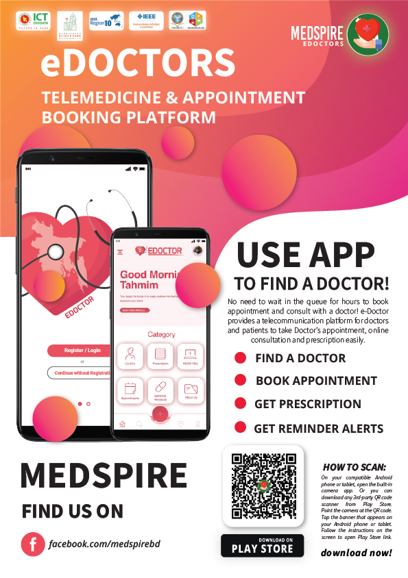
  <br>
  <br>
  <br>
  <br>


  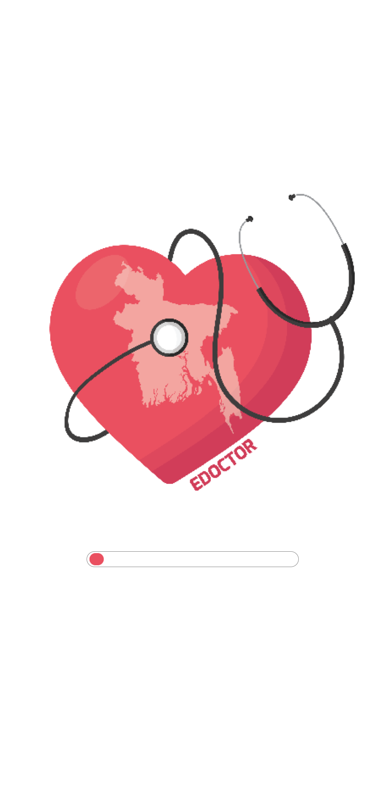
  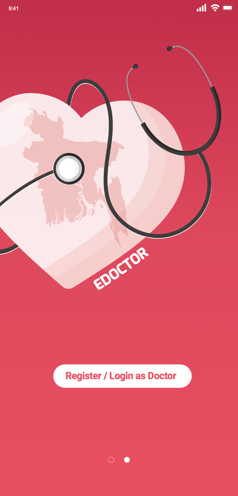
  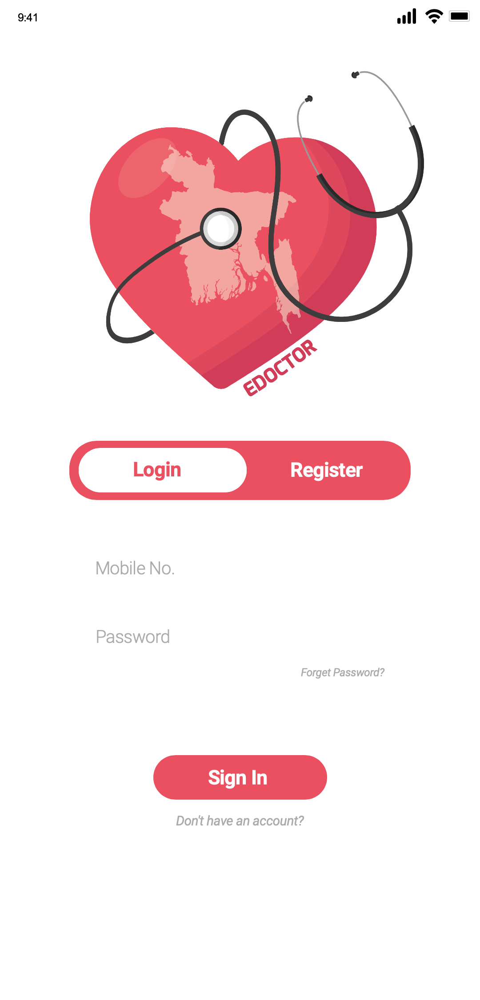
  <br>
  <br>
  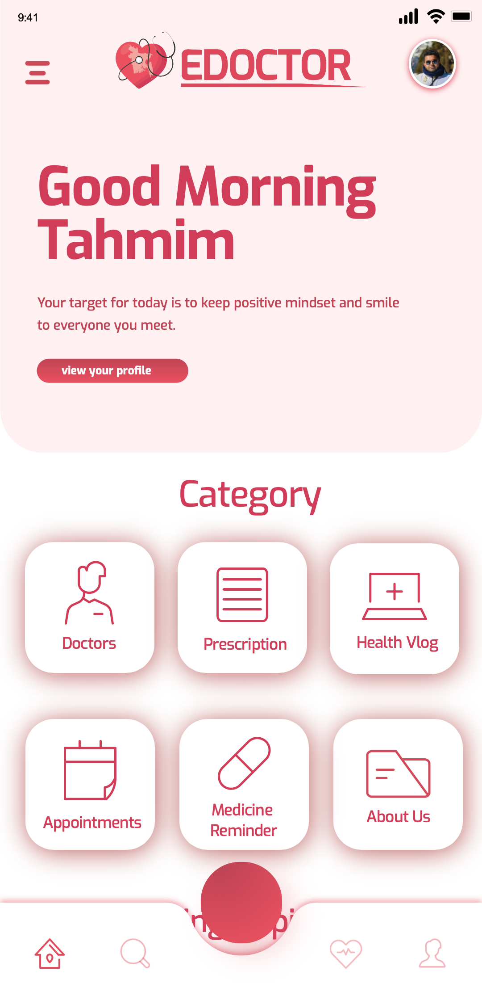
  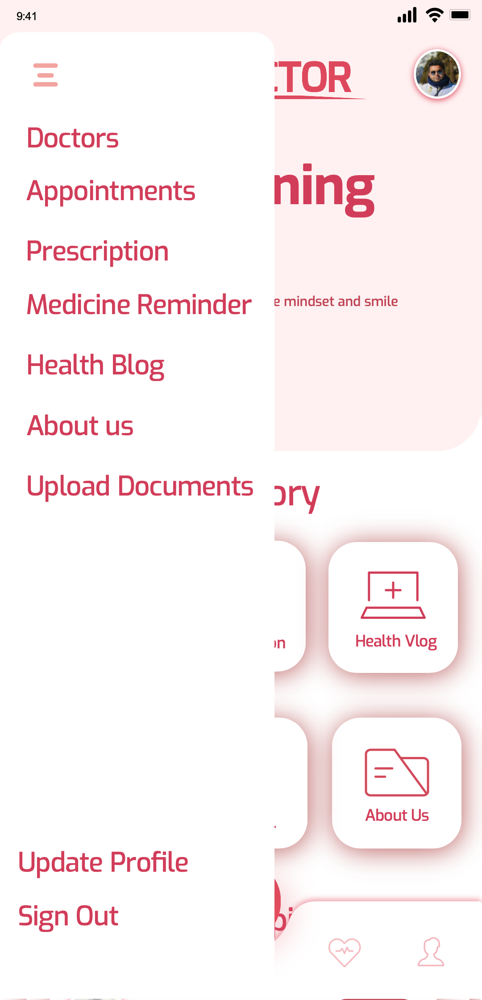
  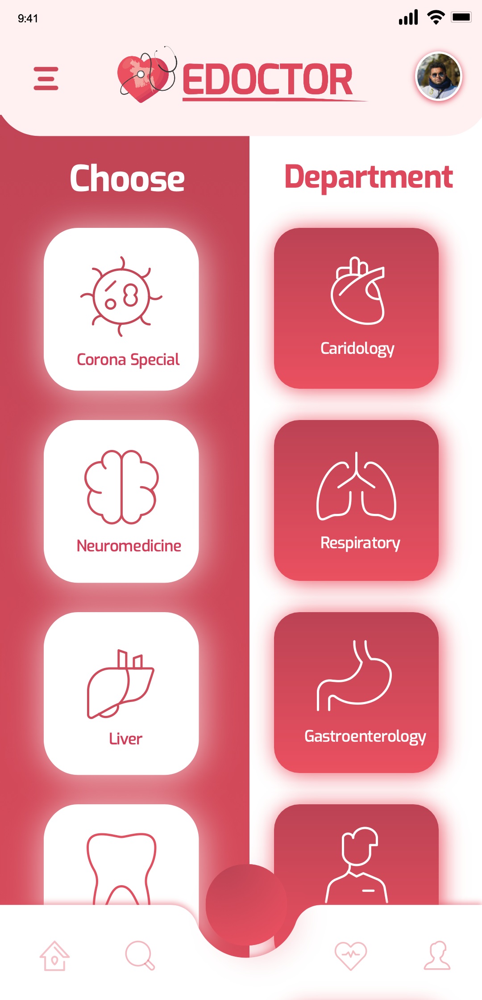
  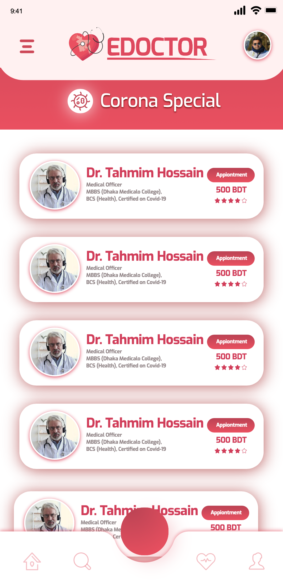

  <br>
  <br>
  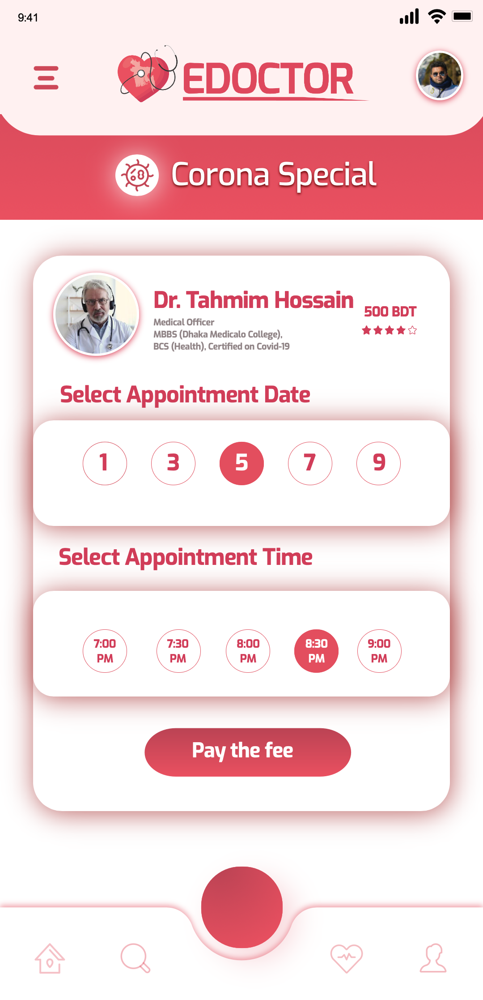
  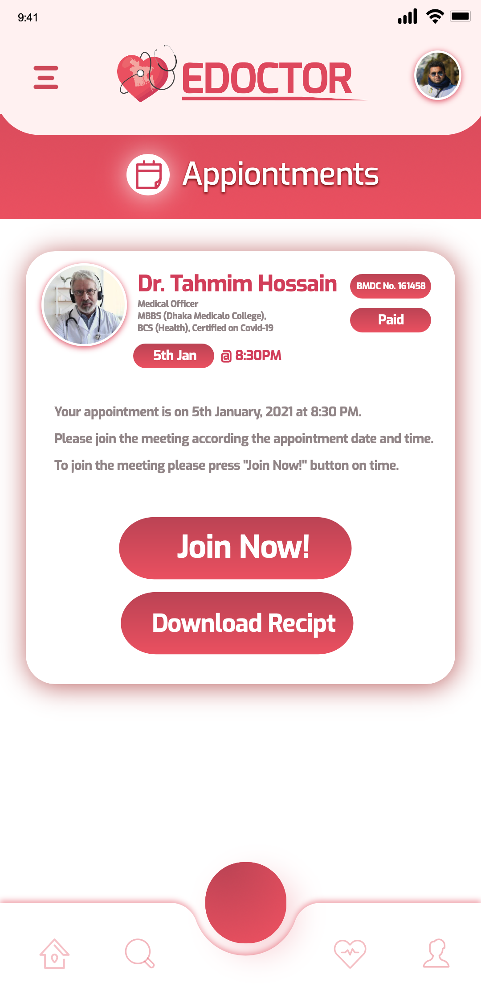
  
  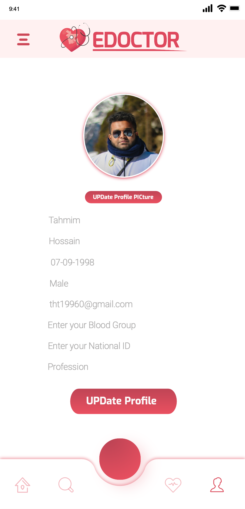
 
  <br>
  <br>
  <br>
  <br>
   

  <br>
  <br>
  <br>
  <br>
   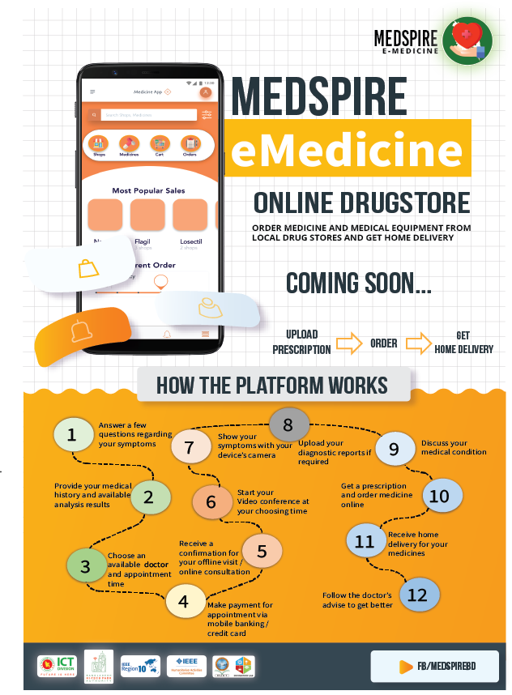
  <br>
  <br>
  <br>
  <br>
     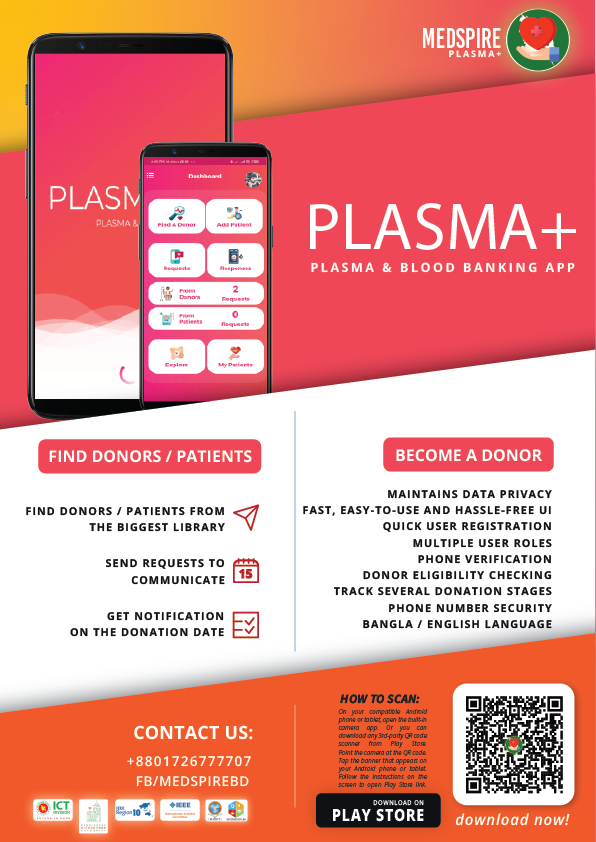
  <br>
  <br>
  <br>
  <br>


</p>

### Built With

* [Firebase](https://firebase.google.com)
* [Retrofit](https://square.github.io/retrofit/)
* [Picasso](https://square.github.io/picasso/)
* [Android Image Cropper](https://github.com/ArthurHub/Android-Image-Cropper/)


### Features
- [x] Dedicated appointment booking
- [x] Integrated database – the biggest library of doctors
- [x] Maintains data privacy
- [x] Fast, easy-to-use and hassle-free
- [x] Quick user registration & profile creation
- [x] Multiple user roles
- [x] Phone verification
- [x] Eligibility checking


### Installation

1. Clone the repo
   ```sh
   git clone https://github.com/khalid-syfullah/e-doctors.git
   ```
2. Download & Install Gradle packages

4. Add dependencies in app `build.gradle` file
   ```Java
   dependencies {
    
    implementation 'com.google.firebase:firebase-analytics:17.2.2'
    implementation 'com.google.firebase:firebase-auth:19.3.2'
    implementation 'com.google.firebase:firebase-messaging:20.2.1'
    implementation 'com.squareup.retrofit2:retrofit:2.1.0'
    implementation 'com.squareup.retrofit2:converter-gson:2.1.0'
    implementation 'com.squareup.picasso:picasso:2.71828'
    implementation 'org.jsoup:jsoup:1.11.1'
    api 'com.theartofdev.edmodo:android-image-cropper:2.8.+'
    }

   ```


<!-- USAGE EXAMPLES -->
## Usage

Use this space to show useful examples of how a project can be used. Additional screenshots, code examples and demos work well in this space. You may also link to more resources.

_For more examples, please refer to the [Documentation](https://www.youtube.com/watch?v=5m7xHHdIbIc)_


<!-- ROADMAP -->
## Roadmap

See the [open issues](https://github.com/khalid-syfullah/e-doctors/issues) for a list of proposed features (and known issues).


<!-- CONTRIBUTING -->
## Contributing

1. Fork the Project
2. Create your Branch (`git checkout -b khalid-syfullah/e-doctors`)
3. Commit your Changes (`git commit -m 'Add some Changes'`)
4. Push to the Branch (`git push origin khalid-syfullah/e-doctors`)
5. Open a Pull Request


<!-- LICENSE -->
## License

Distributed under the MIT License. See `LICENSE` for more information.


<!-- CONTACT -->
## Contact

Your Name - [@khalid_syfullah](https://twitter.com/khalid_syfullah) - khalidsyfullah@gmail.com

Project Link: [https://github.com/khalid-syfullah/e-doctors](https://github.com/khalid-syfullah/e-doctors)


<!-- ACKNOWLEDGEMENTS -->
## Acknowledgements
* [Choose an Open Source License](https://choosealicense.com)
* [GitHub Pages](https://pages.github.com)

[contributors-shield]: https://img.shields.io/static/v1?label=Contributors&message=2&color=red
[contributors-url]: https://github.com/khalid-syfullah/e-doctors/graphs/contributors
[forks-shield]: https://img.shields.io/static/v1?label=Forks&message=1&color=green
[forks-url]: https://github.com/khalid-syfullah/e-doctors/network/members
[stars-shield]: https://img.shields.io/static/v1?label=Stars&message=1&color=blue
[stars-url]: https://github.com/khalid-syfullah/e-doctors/stargazers
[issues-shield]: https://img.shields.io/static/v1?label=Issues&message=0&color=yellow
[issues-url]: https://github.com/khalid-syfullah/e-doctors/issues
[license-shield]: https://img.shields.io/static/v1?label=Licenses&message=0&color=purple
[license-url]: https://github.com/khalid-syfullah/e-doctors/blob/master/LICENSE.txt
[linkedin-shield]: https://img.shields.io/static/v1?label=LinkedIn&message=Khalid-Syfullah&logo=linkedin
[linkedin-url]: https://bd.linkedin.com/in/khalid-syfullah
[product-screenshot]: https://github.com/Khalid-Syfullah/E-Doctors/logo/Logo.png
